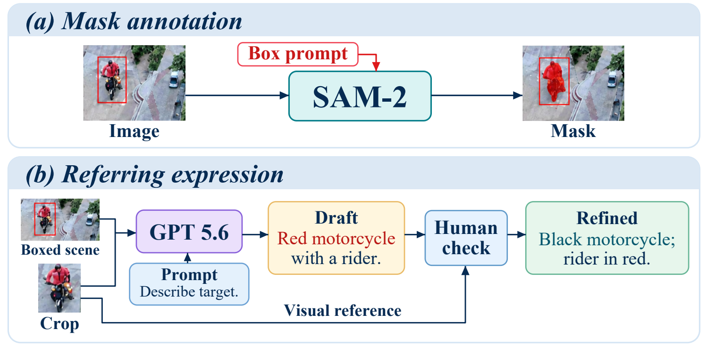
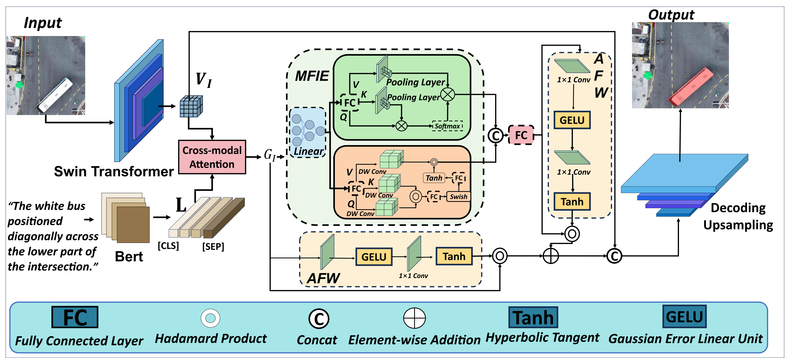
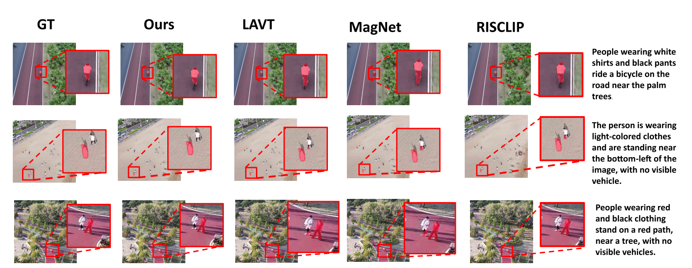
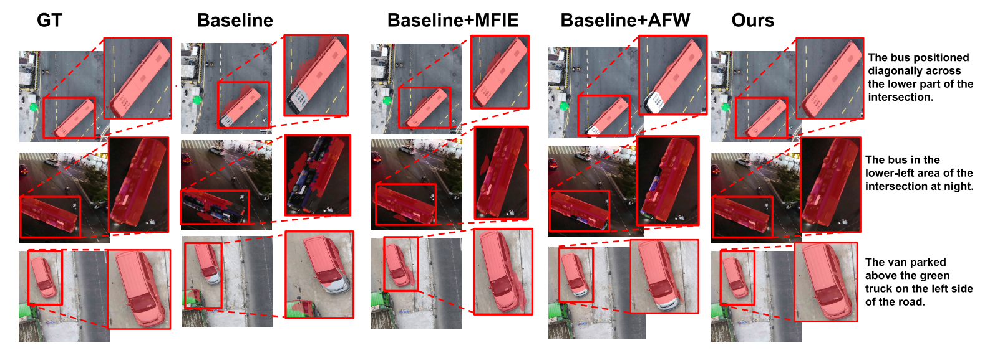

<div align="center">

# MIAWNet

### Multi-scale Interaction and Adaptive Weighting<br>for Referring Image Segmentation in Low-altitude UAV Imagery

**Shuo Zhang · Quanzhen Chen · Haoyu Pan · Ming Li · Zizhu Fan · Qi Wu**

**Global context. Local detail. Adaptive target discrimination.**


**[Paper (PDF)](assets/paper/MIAWNet.pdf)** &nbsp;·&nbsp; **[Framework (PDF)](assets/figures/framework.pdf)** &nbsp;·&nbsp; **[Dataset Download](https://drive.google.com/file/d/1bgE3XX192pZ4l6NpVN2WDiv4olWkADgK/view?usp=sharing)**

[Dataset](#dataset) &nbsp;·&nbsp; [Overview](#overview) &nbsp;·&nbsp; [Method](#method) &nbsp;·&nbsp; [Results](#results) &nbsp;·&nbsp; [Visualizations](#visualizations) &nbsp;·&nbsp; [Getting Started](#getting-started) &nbsp;·&nbsp; [Code Guide](#code-guide)

</div>

---

## Dataset

**DroneRIS** is a fine-grained benchmark for referring image segmentation in low-altitude UAV imagery. Each image is paired with a natural-language description and a binary mask of the referred instance. Small, densely distributed objects, varying viewpoints, and nighttime scenes make precise target grounding challenging.

The manuscript describes **10,851 image–expression–mask triplets** across **eight categories**, with an approximate **7:1:2 train / validation / test split**. Source videos are kept disjoint across splits. The annotation pipeline combines box-prompted SAM 2 masks, multimodal description generation, and manual verification.

<p align="center">
  <a href="assets/figures/dataset_pipeline.png">
    
  </a>
</p>
<p align="center"><em>Figure 2 of the manuscript: construction of verified image–expression–mask annotations.</em></p>

| Property | Description |
| :--- | :--- |
| Image source | CO-Drone UAV videos |
| Categories | People, car, motor, bicycle, tricycle, truck, bus, boat |
| Source patch size | 1080 × 1080 |
| Viewing angles | 30°–90°, with daytime and nighttime scenes |
| Small-object coverage | More than 90% of instances occupy less than 10% of the image |
| Split policy | Approximately 7:1:2, with source-video separation |

### Download the dataset

**[Download DroneRIS.zip from Google Drive](https://drive.google.com/file/d/1bgE3XX192pZ4l6NpVN2WDiv4olWkADgK/view?usp=sharing)**

This RIS-LAD-derived release contains **10,851 image–expression–mask triplets**, **2,082 images**, and **8 categories**. The train / validation / test splits contain **7,596 / 1,085 / 2,170 triplets**, respectively (approximately 7:1:2).

## Overview

MIAWNet segments the image target specified by a natural-language expression. The model addresses two common errors in low-altitude UAV scenes: **category drift**, where a different object category is selected, and **object drift**, where another instance of the correct category is selected.

Its two main components combine global and local visual-language features, then independently weight the original and enhanced feature streams before multi-scale decoding.

<table align="center">
  <tr>
    <th align="center">73.59%</th>
    <th align="center">78.09%</th>
    <th align="center">71.12%</th>
  </tr>
  <tr>
    <td align="center">DroneRIS Test oIoU</td>
    <td align="center">RefCOCO TestA oIoU</td>
    <td align="center">RefCOCO+ TestA oIoU</td>
  </tr>
</table>

<p align="center"><sub>Results reported in Table 2 of the manuscript; not newly reproduced measurements from this code release.</sub></p>

## Method

<p align="center">
  <a href="assets/figures/framework.pdf">
    
  </a>
</p>
<p align="center"><em>Author-supplied framework: language-aligned features are enhanced through global/local interaction and adaptively fused before decoding.</em></p>

| Component | Role |
| :--- | :--- |
| **Swin-B + BERT** | Extract hierarchical visual features and token-level text representations. |
| **Cross-modal attention** | Aggregate relevant text features at each visual location. |
| **Multi-scale Feature Interaction and Extraction (MFIE)** | Combine pooled global attention with depthwise local feature processing. |
| **Adaptive Feature Weighting (AFW)** | Learn independent signed weights for the original and enhanced feature streams. |
| **Multi-scale decoder** | Aggregate visual and semantic features across stages and restore the mask resolution. |
| **BCE + Dice** | Supervise the final mask with equally weighted pixel-level and region-level objectives. |

MFIE follows equations (1)–(4), AFW follows equations (5)–(7), and the training loss follows equations (8)–(10). Details not specified by the manuscript, including feature widths, pooling sizes, and decoder structure, are documented in [implementation notes](docs/implementation.md).

## Results

### DroneRIS benchmark

**DroneRIS test results from Table 2 of the manuscript.** oIoU is reported as a percentage; higher is better.

| Method | Backbone | oIoU ↑ |
| :--- | :--- | ---: |
| EFN | ResNet-101 | 51.13 |
| BUSNet | ResNet-101 | 51.79 |
| CGAN | DarkNet-53 | 51.01 |
| VLT | DarkNet-53 | 52.99 |
| SeqTR | DarkNet-53 | 59.68 |
| MaIL | ViT-B-16 | 62.45 |
| CRIS | ResNet-101 | 59.87 |
| ETRIS | ViT-B-16 | 59.82 |
| CNNFormer | ResNet-50 + Swin-B | 60.84 |
| BarLeRIa | CLIP-B | 62.40 |
| LAVT | Swin-B | 61.24 |
| MagNet | Swin-B | 64.36 |
| RISCLIP | CLIP-B | 63.10 |
| **MIAWNet** | **Swin-B** | **73.59** |

<details>
<summary><b>RefCOCO and RefCOCO+ results</b></summary>

MIAWNet results from Table 2 of the manuscript, evaluated with oIoU (%).

| Benchmark | Val | TestA | TestB |
| :--- | ---: | ---: | ---: |
| RefCOCO | 75.96 | 78.09 | 70.26 |
| RefCOCO+ | 66.31 | 71.12 | 58.96 |

</details>

<details>
<summary><b>DroneRIS module ablations</b></summary>

Results from Table 3 of the manuscript, described in the text as validation-set ablations. All values are percentages.

| MFIE | AFW | mIoU ↑ | oIoU ↑ | P@0.5 ↑ | P@0.7 ↑ | P@0.9 ↑ |
| :---: | :---: | ---: | ---: | ---: | ---: | ---: |
| — | — | 74.46 | 72.73 | 74.44 | 65.58 | 30.23 |
| ✓ | — | 75.30 | 73.12 | 74.95 | 66.06 | 30.30 |
| — | ✓ | 74.92 | 73.04 | 75.63 | 66.84 | 30.48 |
| ✓ | ✓ | **75.88** | **73.59** | **76.97** | **68.32** | **31.02** |

The full model improves mIoU and oIoU over the baseline by 1.42 and 0.86 percentage points, respectively. The code's AFW-only convention is described in [implementation notes](docs/implementation.md).

</details>

These tables reproduce the values reported in the supplied manuscript. Real benchmark training has not been run for this release, and trained checkpoints are not included. [Verification](docs/verification.md) records the code checks performed locally. Evaluation always takes an explicit split manifest because the manuscript uses both validation and test labels for DroneRIS in different sections.

## Visualizations

### Comparison with other methods

<p align="center">
  <a href="assets/figures/qualitative_comparison.png">
    
  </a>
</p>
<p align="center"><em>Figure 4 of the manuscript: qualitative comparisons in small-target UAV scenes.</em></p>

<details>
<summary><b>Explore module ablations</b></summary>

<p align="center">
  <a href="assets/figures/qualitative_ablation.png">
    
  </a>
</p>

Figure 5 of the manuscript compares the baseline and module variants in daytime, nighttime, and crowded vehicle scenes. These are paper figures, not predictions generated by the release.

</details>

## Getting Started

### 1. Installation

Run the following commands from the repository root using Python 3.10:

```bash
conda env create -f environment.yml
conda activate miawnet
python -m pip install -e .
```

Alternatively, use a virtual environment:

```bash
python -m venv .venv
source .venv/bin/activate
python -m pip install -r requirements.txt
python -m pip install -e .
```

On Windows, activate with `.venv\Scripts\Activate.ps1`. The supplied recipe targets PyTorch 2.0.0 and torchvision 0.15.1. Select a compatible CUDA build using the [official PyTorch version guide](https://pytorch.org/get-started/previous-versions/). Python 3.12 requires a newer compatible PyTorch/torchvision pair; use `python -m pip install -e ".[refcoco]"` in that environment instead of the paper-version requirements.

<details>
<summary><b>Pretrained encoders and reproducibility</b></summary>

- Swin-B uses torchvision's ImageNet-1K checkpoint; BERT defaults to `bert-base-uncased`. Both are downloaded on first training use.
- For offline use, cache the torchvision checkpoint, point `model.bert_name` to a local BERT directory with model and tokenizer files, and set `model.local_files_only: true`.
- Both encoders are optimized end to end. Mixed precision is disabled by default and can be enabled with `training.amp: true`.
- [requirements.txt](requirements.txt) provides pinned dependencies for the manuscript's Python 3.10 / PyTorch 2.0 setup and annotation conversion. [Verification](docs/verification.md) describes the different local CPU test environment.
- [Implementation notes](docs/implementation.md) list the choices made for unspecified details. They must be reconciled with original experimental configurations for an exact reproduction.

</details>

### 2. Prepare data

```text
data/droneris/
├── images/
├── masks/
└── annotations/
    ├── train.jsonl
    ├── val.jsonl
    └── test.jsonl
```

One JSONL record describes one image–expression pair and the referred instance mask:

```json
{"id":"video03_frame001_car02","image":"images/video03/frame001.jpg","mask":"masks/video03/frame001_car02.png","text":"The white car next to the bus.","video_id":"video03"}
```

Masks use background 0 and foreground 1 or 255. Image and mask dimensions must match. Paths are relative to `data.root`, or absolute. Check masks and source-video separation before training:

```bash
python tools/check_data.py --root data/droneris \
  --manifests annotations/train.jsonl annotations/val.jsonl annotations/test.jsonl \
  --require-video-ids
```

<details>
<summary><b>Convert RefCOCO or RefCOCO+ annotations</b></summary>

Obtain trusted official referring annotations and COCO train2014 images, then convert them:

```bash
python tools/convert_refcoco.py \
  --refs "downloads/refcoco/refs(unc).p" \
  --instances downloads/refcoco/instances.json \
  --images downloads/coco/train2014 \
  --output data/refcoco
```

For RefCOCO+, use its annotation files and `--output data/refcoco_plus`. The converter preserves the official split membership and writes one record per referring expression. See [data preparation](docs/data.md) for details.

</details>

### 3. Train

```bash
python train.py --config configs/droneris.yaml
```

The default recipe uses 480 × 480 images, 50 epochs, batch size 8, AdamW, weight decay 0.05, and a cosine learning rate from 3e-5 to 1e-6. No random data augmentation or auxiliary losses are applied. The checkpoint with the highest validation mIoU is saved as `best.pt`.

```bash
python train.py --config configs/droneris.yaml --resume runs/droneris/last.pt
python train.py --config configs/refcoco.yaml
python train.py --config configs/refcoco_plus.yaml
```

Training writes the resolved configuration, per-epoch metrics, `last.pt`, and `best.pt`. Resume restores the model, optimizer, scaler, and random states at an epoch boundary. Model, data, and training settings must match; runtime settings may change.

### 4. Evaluate

```bash
python evaluate.py --checkpoint runs/droneris/best.pt \
  --manifest annotations/test.jsonl --output runs/droneris/test.json

python evaluate.py --checkpoint runs/refcoco/best.pt \
  --manifest annotations/testA.jsonl --output runs/refcoco/testA.json
```

The evaluator reports oIoU, mIoU, and P@0.5/0.7/0.9 as percentages. P@X uses `IoU > X`. By default, logits are resized to the native mask dimensions before thresholding at probability 0.5. Use `--resolution resized` for training-resolution metrics, and report that choice with the results.

### 5. Predict

```bash
python predict.py --checkpoint runs/droneris/best.pt \
  --image scene.jpg --text "The white car next to the bus." \
  --output runs/demo/mask.png --overlay runs/demo/overlay.png
```

The binary mask and optional overlay retain the original image dimensions. Only load checkpoints from a trusted source.

<details>
<summary><b>Run module ablations</b></summary>

```bash
python train.py --config configs/ablations/baseline.yaml
python train.py --config configs/ablations/mfie.yaml
python train.py --config configs/ablations/afw.yaml
python train.py --config configs/droneris.yaml --output runs/ablations/full
```

The same data and training defaults are used for all variants. `bash scripts/ablations.sh` runs them sequentially on Linux.

</details>

## Code Guide

<details>
<summary><b>Repository structure</b></summary>

```text
MIAWNet/
├── assets/
│   ├── figures/               # Framework and manuscript figures
│   └── paper/                 # Author-supplied manuscript
├── configs/                   # Dataset and ablation configurations
├── src/miawnet/
│   ├── models/                # Encoders, cross-modal attention, MFIE, AFW, decoder
│   ├── data.py                # Image-expression-mask loader
│   ├── losses.py              # BCE + Dice
│   ├── metrics.py             # oIoU, mIoU, P@X
│   └── engine.py              # Training, evaluation, checkpoint utilities
├── scripts/                   # Linux launch scripts
├── tools/                     # Data audit and RefCOCO conversion
├── tests/                     # Numerical and integration checks
├── docs/                      # Data, implementation, usage and verification
├── train.py                   # Training entry point
├── evaluate.py                # Evaluation entry point
├── predict.py                 # Prediction entry point
├── environment.yml            # Python 3.10 environment recipe
├── requirements.txt
└── CITATION.cff
```

</details>

| Component | Implementation |
| :--- | :--- |
| Main architecture and encoders | [network.py](src/miawnet/models/network.py) |
| Cross-modal attention, MFIE, AFW, decoder | [modules.py](src/miawnet/models/modules.py) |
| Dataset | [data.py](src/miawnet/data.py) |
| Training objective | [losses.py](src/miawnet/losses.py) |
| Evaluation metrics | [metrics.py](src/miawnet/metrics.py) |
| Training and checkpoint handling | [engine.py](src/miawnet/engine.py) · [train.py](src/miawnet/train.py) |

<details>
<summary><b>Development checks</b></summary>

```bash
python -m pip install -e ".[dev,refcoco]"
ruff check src tests train.py evaluate.py predict.py tools
ruff format --check src tests train.py evaluate.py predict.py tools
pytest -q
```

Tests use synthetic data and compact injected encoders without pretrained downloads. The GitHub Actions workflow runs the checks on pushes and pull requests. See [verification](docs/verification.md) for the complete-model forward check and local test results.

</details>

## Citation

Please cite the MIAWNet manuscript when using this work. Author and title metadata are provided in [CITATION.cff](CITATION.cff); the supplied manuscript does not include a DOI or publication venue.

```bibtex
@unpublished{zhang_miawnet,
  title  = {MIAWNet: Multi-scale Interaction and Adaptive Weighting for
            Referring Image Segmentation in Low-altitude UAV Imagery},
  author = {Zhang, Shuo and Chen, Quanzhen and Pan, Haoyu and
            Li, Ming and Fan, Zizhu and Wu, Qi},
  note   = {Manuscript}
}
```

## Acknowledgements

The encoders use [torchvision](https://github.com/pytorch/vision) and [Hugging Face Transformers](https://github.com/huggingface/transformers), following the [Swin Transformer](https://github.com/microsoft/Swin-Transformer) and [BERT](https://github.com/google-research/bert) architectures. RefCOCO instance masks are prepared with [COCO API](https://github.com/cocodataset/cocoapi). Research references are listed in the supplied manuscript.

---

<p align="center"><a href="#miawnet">Back to top ↑</a></p>
